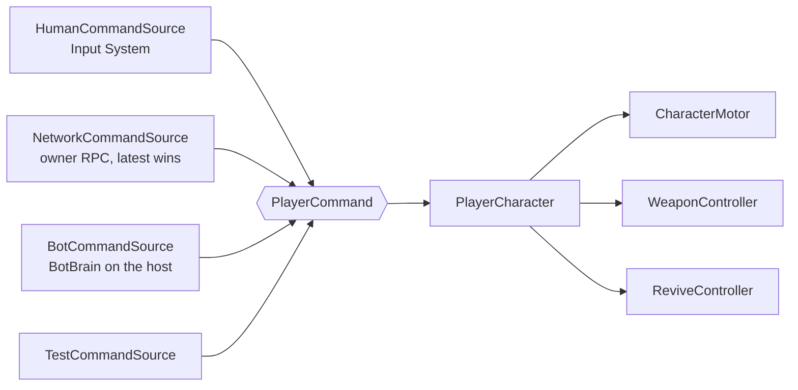
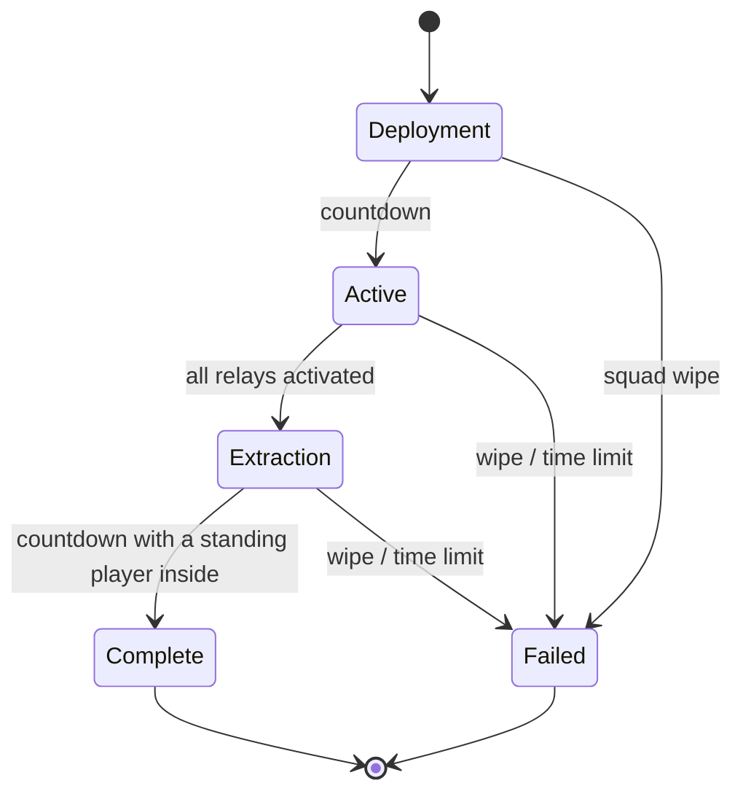
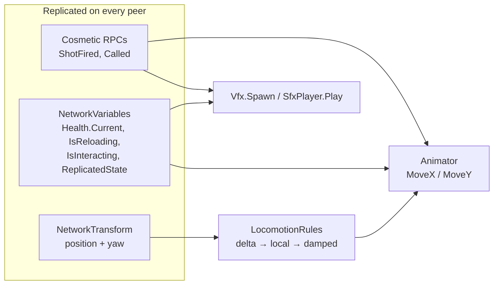

# Architecture

Records the decisions behind DropProtocol's major systems. It explains *why* things are shaped the
way they are; it does not restate what the code already says.

Guiding principle: **the simplest architecture that cleanly supports the requirements we actually
have.** A system is generalized only once a real second use case exists.

## Status

Milestones 1 to 7 are in place: the command abstraction, `CharacterMotor`, `PlayerCharacter`,
`HumanCommandSource`, the top-down camera, a host/client session with server-authoritative
movement over Unity Transport, combat (assault rifle, health, downed state, revive), PvE (Grunt,
Spitter, Brute, NavMesh navigation, the threat-budget director), squad bots that fill the empty
slots, the relay mission (deployment, relays, extraction, results), and support protocols (Supply,
Sentry, Strike called in by directional sequences), and Milestone 8's presentation (animation, VFX,
audio), the uGUI HUD with its debug panel and network overlay, and the release build. The vertical
slice described by the original design is complete; the sections below record how each part is shaped
and why.

## Assemblies and namespaces

Three assemblies plus one editor-only helper:

```text
DropProtocol
DropProtocol.Tests.EditMode
DropProtocol.Tests.PlayMode
DropProtocol.Editor          (Assets/_Project/Editor: the build script only)
```

Feature-specific assemblies are added only when a real compile-time or dependency problem demands
one; `DropProtocol.Editor` exists because `UnityEditor` code cannot compile into the player
assembly, which is exactly that case. Runtime code sits in a single flat `DropProtocol` namespace; the subfolders under
`_ProjectScripts.DropProtocol/` express feature organization and deliberately do **not** mirror into
namespaces.

## Command abstraction (Milestone 1)

The player character must not depend on human input. Every command producer — local input, a
network client, a bot brain, or a test — feeds the same struct:

```text
Human Input ─────┐
Network Input ───┼──> PlayerCommand ──> PlayerCharacter
Bot AI ──────────┘
```



```csharp
public struct PlayerCommand
{
    public Vector2 Move;
    public Vector2 Aim;
    public bool Fire;
    public bool Reload;
    public bool Interact;
}

public interface IPlayerCommandSource
{
    PlayerCommand GetCommand();
}
```

**Rule:** gameplay character code must never know whether its commands came from a human, a network
client, a bot, or a test. This is what makes bot squadmates and automated gameplay tests cheap.

### Command semantics

- `Move` and `Aim` are **world-space XZ** vectors (`x` is world X, `y` is world Z). Camera-relative
  conversion happens in `HumanCommandSource`, so `PlayerCharacter` never knows a camera exists and
  bots or network sources produce world-space vectors naturally. `CommandMath` holds the conversions.
- `Move` has magnitude 0..1. `Aim` is a unit direction, or zero meaning "keep the current facing".
- `Fire`, `Reload`, and `Interact` are **held state for the sample**, not press events. Edge detection
  belongs to the consumer (for example the weapon controller). Commands will be sampled at a network
  tick rate in Milestone 2, and a "pressed this frame" flag would be lost between samples.

### Wiring a source

`PlayerCharacter.SetCommandSource()` is the explicit API and is what spawners, bots, and tests use.
As a convenience for scene-authored prefabs, `Awake` falls back to any `IPlayerCommandSource`
component on the same GameObject, which is how the sandbox player picks up `HumanCommandSource`.

### Character motor

`CharacterMotor` drives a kinematic `CharacterController` with manual gravity and takes only
world-space intent. A Rigidbody was rejected: physics-driven movement is harder to make
authoritative and deterministic once the host owns movement in Milestone 2. Facing is the aim
direction if any, else the move direction, else unchanged, smoothed by a turn speed. The math lives
in `MotorMath` so it can be unit-tested without a scene.

### Top-down camera

Cinemachine 3 `CinemachineCamera` + `CinemachineFollow` with a world-space offset and light damping.
There is no rotation component, so the camera keeps its authored 60° pitch. `LocalPlayerCamera`
(Milestone 2) is the only camera script: it retargets the Cinemachine camera whenever the local
client's player spawns or despawns, listening to `NetworkPlayer` events so the character stays
unaware of cameras.

### Testing seams

- EditMode tests cover the pure math (`CommandMath`, `MotorMath`) and `PlayerCommand`.
- PlayMode tests build a character from code and drive it through `TestCommandSource`, which lives
  in the PlayMode test assembly because tests are its only use case.

## Networking (Milestone 2)

Full detail and the decision log live in [Networking.md](Networking.md). The architectural shape:

```text
00_Bootstrap ── NetworkRoot (NetworkManager + UnityTransport + NetworkSession) ── persists
01_MainMenu ── MainMenuController ──> NetworkSession.StartHost / StartClient
90_Sandbox ── PlayerSpawner (server) ──> PlayerCharacter prefab + NetworkPlayer + NetworkTransform
```

- `NetworkSession` is the only class that talks to `NetworkManager`. UI, sandbox panel, and tests
  go through it; it owns approval, scene flow, and the "why did I get disconnected" message.
- Movement is **server-authoritative**: owners send `PlayerCommand`s each tick, the host runs the
  Milestone 1 character unchanged, and `NetworkTransform` replicates. `NetworkCommandSource` is the
  network implementation of `IPlayerCommandSource`; the character still cannot tell it from a human
  or a bot.
- `PlayerCommand` serializes itself (`INetworkSerializable`, buttons packed into one byte). That is
  the only Milestone 1 type Milestone 2 touched.
- Pure rules are split out for EditMode tests: `SessionRules` (max players, address parsing),
  `SpawnSlots` (lowest free slot), `NetworkCommandSource` (staleness, injected clock).
- Presentation stays separate: `PlayerTint` and `LocalPlayerCamera` read replicated state and
  events; they never write gameplay.

## Player character composition (Milestone 1–3)

`PlayerCharacter` coordinates; it does not implement everything.

```text
PlayerCharacter
├── CharacterMotor
├── WeaponController      (Milestone 3)
├── Health                (Milestone 3)
├── ReviveController      (Milestone 3)
└── ProtocolController    (Milestone 7, own input channel; see Support Protocols)
```

`PlayerCharacter.Update` reads one command and forwards it explicitly to each sub-system. Siblings
never sample the command source themselves: this keeps "what may a downed character do" in one
place, and every sub-system sees the same sample instead of depending on `Update` order. Every
sibling except the motor is optional, so tests can still build a bare moving character. There is no
`InteractionController`: the one interaction besides revive, charging a relay, is read by the relay
from the command the character applied (see Mission).

## Combat (Milestone 3)

Weapons are data, not code branches. `WeaponDefinition` ScriptableObjects carry damage, fire rate,
magazine size, reload duration, spread, range, a pellet count and a hit mode. Weapon-specific `if`
branches are a bug, not a shortcut. Three definitions exist (assault rifle, shotgun, machine gun);
the shotgun is the rifle's code path with eight pellets, each carrying the full damage and its own
spread sample, so a spread shot needs no shotgun branch. The player prefab lists the two extras in
an arsenal and `WeaponController.Equip` switches by index on the host, replicating the index so every
peer resolves the same definition for its flash, sound and HUD name; the F1 debug panel cycles it.
Player-facing weapon switching (a slot in `PlayerCommand`) is still to come.

### Definition vs. state

`WeaponDefinition` is immutable configuration; `WeaponState` (plain C#) is the mutable magazine,
cooldown, and reload timer. Time is passed into `WeaponState` rather than read from `Time`, so fire
rate and reload rules are EditMode-tested. `WeaponMath` holds the spread rotation with the random
sample injected for the same reason.

### Hitscan on the server

The assault rifle is hitscan: `WeaponController.Tick` runs only on the host, resolves the shot with a
`Physics.RaycastNonAlloc`, and applies damage directly to the `Health` it hits. Projectiles are a
recognised hit mode in the data but not implemented; nothing in the vertical slice needs travel time
yet. The ray starts from the shooter's centre line at muzzle height, not from the muzzle itself: a
ray never reports the collider it starts inside (which excludes the shooter for free), and a wall the
character is pressed against still blocks the shot. The muzzle sits at 0.9 m so 1 m sandbox cover
works as cover; future level geometry meant to block fire must be at least that tall.

`Fire` is held state, so full-auto is "fire while held, gated by the cooldown". `Reload` is a rising
edge tracked inside the controller. The host's own character ticks at render rate and remote
characters at the 30 Hz command rate; because the cooldown is time-based, both get the same fire rate.

### Health, downed, revive

`Health` holds an integer `NetworkVariable` written only by the server. **Downed is derived** from
zero HP rather than stored separately, so it cannot desync from the replicated value. There is no
`IDamageable` interface yet: the player and the sandbox target dummy both use the same `Health`
component, and an interface with one implementer is the speculative abstraction this project avoids.
It arrives when something that is not a `Health` needs to take damage (a sentry, say).

A downed character stays in the world, keeps its gravity, and ignores every command. A teammate holding
`Interact` inside `ReviveController`'s radius fills a progress value; on completion the target stands
up at half health. Progress lives on the reviver, so two players reviving one body never contend over
a single value. There is no respawn and no bleed-out timer; a squad with nobody standing is a
mission failure (see Mission).

### Presentation

`HealthBar` and `HitscanTracer` read replicated state or the cosmetic `ShotFired` event and never
write gameplay, following the `PlayerTint` pattern. Flashing the bar on a decrease is the hit
marker; a red empty track is the downed marker. `DownedPose` (a rotated visual child) remains only
on the sandbox target dummy; characters play a clip instead (see Presentation split).

## Enemies and the director (Milestone 4)

Enemies are data plus one behaviour. `EnemyDefinition` ScriptableObjects (Grunt, Spitter, Brute)
carry health, threat cost, speed, agent radius, damage, attack range, preferred and minimum range,
cooldown and windup. A single `EnemyCharacter` reads them; the three archetypes differ only in
numbers and in which attack component sits beside it (`MeleeAttack` or `SpitAttack`, both
`IEnemyAttack`). There is no enemy kind enum and no `if (kind == Spitter)`.

### Brain vs. body

`EnemyBrain` (plain C#, time injected) is the state machine: Idle, Chase, Attack, Dead. In Chase,
`EnemyRules.ResolveMove` picks Approach, Hold or Retreat from the preferred and minimum range, which
is how "keeps its distance" is expressed for the Spitter without a Spitter branch. Attack is a windup
followed by a one-update trigger; the attack component only performs the effect, so a melee target
that stepped away during the windup is simply missed. `EnemyCharacter` owns the NavMeshAgent, the
target lookup and death.

### Navigation and targeting

Only the host runs the agent; clients keep it disabled and display `NetworkTransform`. The sandbox
ground carries a baked `NavMeshSurface` built from physics colliders, so obstacles and dummies are
holes. Targeting reads `NetworkPlayer.All`, a small server-side registry justified by its three
consumers (enemies, the director, bots), and never picks a downed player. With no alive
player in the world the enemy idles; the mission director declares the wipe.

### Death

An enemy is dead, not downed: the zero-health edge stops the agent, disables the collider and
despawns the object a second later. `Health` stays generic; it only gained `SetMaxHealth` so the
definition can override the prefab value before spawn. `DownedPose` and `HealthBar` are reused for
the death pose and the red track. Still no `IDamageable`: enemies are `Health` too.

### Spit projectile

`SpitProjectile` is a server-simulated NetworkObject with no collider. Each server frame it sweeps a
sphere over the step it is about to take, so it cannot tunnel and can never block player hitscan. It
ignores its shooter and other enemies, damages the first `Health` it meets, and despawns on any hit
or after its lifetime. Clients see it through a position-only `NetworkTransform`.

### Threat budget

`DirectorState` (plain C#, roll and time injected) accrues budget per second scaled by player count
and an intensity multiplier the mission director drives, rolls the next archetype by weight, then saves up
until it can afford it, so Brutes are not starved by Grunts. Population is capped per player count.
`EnemyDirector` is an in-scene server-only NetworkBehaviour like `PlayerSpawner`: it spawns at the
edge point farthest from the squad, round-robin, and only while `Running`, which the sandbox panel
toggles. A seeded `System.Random` is the only randomness, so a run is reproducible.

```text
Grunt = 1   Spitter = 3   Brute = 6
```

## Bots (Milestone 5)

A bot is a normal player character with a different command source. `PlayerSpawner` instantiates
the same prefab humans get, binds a `BotCommandSource` before the object spawns, and spawns it
server-owned; nothing about the character, its weapon, health or revive changes. Bots only ever
emit `PlayerCommand`, so every gameplay rule (friendly fire, reload timing, the revive hold) applies
to them unchanged.

### Brain vs. body

`BotBrain` (plain C#, no clock) is a priority ladder, not a graph: revive a downed squadmate, else
fight, else follow. `BotRules` holds the pure hysteresis (stop and resume radius for following,
engage and disengage range for fighting) and the reload policy (top up whenever nothing is in
sight; under fire only an empty magazine is worth the pause). `BotCommandSource` runs perception
and the brain at a think rate, then every frame turns the decision into a command: steering, aim,
the line-of-fire check and the revive hold. Objective work is the rung below combat (see Mission).

### Perception

Bots read the registries enemies read. The leader is the nearest alive human, never another bot,
so two bots cannot orbit each other; with no human standing a bot holds and, if someone is down,
goes to revive. The target is the nearest alive enemy in `EnemyCharacter.All`. Because
`EnemyTargeting` also reads `NetworkPlayer.All`, enemies attack bots and the director counts them
as players, which is the intended pressure.

### Movement without an agent

The player prefab keeps its `CharacterController` and gains no NavMeshAgent: bots must drive the
character humans drive. Instead `BotCommandSource` asks `NavMesh.CalculatePath` for a path to its
goal at every think and steers toward the next corner each frame, falling back to a straight line
when no path exists. Rejected a NavMeshAgent on the player prefab (two movement systems fighting
over one transform, and a different character for bots).

### Combat

Bots hold formation and shoot from where they stand: they keep following the leader while engaged,
back off when an enemy gets inside melee range, and never charge. Friendly fire is real, so the
source asks `WeaponController.HasLineOfFire` every frame and holds the trigger whenever a squadmate
is in the line; only the centre line is checked, so a spread round can still clip someone standing
right beside it.

### Filling the squad

`PlayerSpawner` owns bot slots next to human ones. With `FillWithBots` on it fills every free slot
on spawn and after a disconnect; a joining human evicts the highest bot slot, because connection
approval counts humans only and a human always outranks a bot. Off by default in the sandbox,
where the panel toggles it; the mission scene turns it on.

## Mission (Milestone 6)

One mission: activate every communication relay, then extract. The in-scene `MissionDirector` is a
server-only NetworkBehaviour like `PlayerSpawner`; it feeds a pure `MissionState`, replicates the
result, and drives the enemy director. Lobby and loading are session concerns (menu, scene load) and
never appear in the phase machine.

### Phase machine

```text
Deployment ──countdown──> Active ──all relays──> Extraction ──countdown──> Complete
     └── squad wipe ───────┴── wipe / time limit ──┴── wipe / time limit ──> Failed
```



`MissionState` (plain C#, inputs and time injected) takes counts, never objects: relays and how many
are activated, players and how many are standing, how many standing players are inside the zone.
Inside a phase the checks run wipe, then time limit, then progress, so a wipe or a time-out always
wins a tie. The clock starts with Active, so deployment never eats into the limit, and a limit of
zero disables it. `MissionRules` holds the individual rules so each is a one-line EditMode test.

### Relay objective

`CommRelay` scans `NetworkPlayer.All` on the server each frame and counts squadmates inside its
radius whose applied command (`PlayerCharacter.LastCommand`) holds `Interact`; that command is
already whatever the human, remote client or bot produced, so nothing new is routed. Progress is
shared, persists when everyone lets go, and fills at one rate however many hold: enemy pressure is
the cost, not restarting. A player whose `ReviveController.Target` is set is skipped, so a revive
always wins over a relay standing next to the body. Relays only charge while the mission is Active
and run ungated when no `MissionDirector` exists (sandbox, tests).

Rejected the originally planned `InteractionController` and `IInteractable`: revive keeps its progress on the
reviver on purpose (two revivers never contend), a relay keeps it on the relay (shared between
holders), and one interface over those two shapes would hide the difference. A second
zone-with-progress objective is the point at which to reconsider. The relay does not take damage, so
`IDamageable` still waits.

### Extraction and results

`ExtractionZone` is a flat-distance check, not a trigger: the countdown runs while at least one
standing player is inside and pauses, never resets, when nobody is. Whoever is inside at zero is
extracted; downed and absent squadmates are left behind and the mission still succeeds with one.
The outcome, extracted count, elapsed time and kill count are `NetworkVariable`s on the director,
so late joiners and the results panel read the same state; there is no separate result message.

### Director coupling

The mission reapplies `EnemyDirector.Running` and `Intensity` every server frame instead of on a
transition: in-scene NetworkObjects spawn in an undefined order and the director resets `Running`
on its own spawn. Deployment is quiet, Active scales intensity with each relay done, Extraction
uses a fixed higher multiplier, and results stop the director and leave the survivors alone.

### Bots

Objective work is the rung between combat and follow. A bot takes the nearest unactivated relay
(or the zone during extraction) only while its leader is within `ObjectiveAssistRange` of it, or
when no human is standing; otherwise it keeps following. So bots help with the objective the squad
is already working, and a squad with every human down can still finish. The goal snap radius for
NavMesh paths widened because a relay post is a hole in the mesh.

### Presentation

`RelayIndicator` and `ExtractionIndicator` colour their meshes from replicated state, following
`PlayerTint`. The mission readout, result card and the host-from-scene card live in the Milestone 8
uGUI HUD (see UI).

## Support Protocols (Milestone 7)

Directional input sequences request authoritative support actions (Supply, Sentry, Strike). The
host validates the sequence and executes the result; clients only request. Each protocol is a
`ProtocolDefinition` ScriptableObject: a display name, its direction sequence, a cooldown and a
payload prefab. The player prefab carries a three-slot loadout; the payload owns everything that
happens after the call-in.

### Input channel

```text
arrow keys / d-pad ──> ProtocolInput (local human only)
                            │ one reliable owner RPC per press
                            ▼
                     ProtocolController ──> ProtocolState (match, timeout, cooldowns)
                            │ Matched + CanCall
                            ▼
                     spawn payload 5 m ahead of the caller
```

Directions do **not** ride `PlayerCommand`. That stream is unreliable, latest-only and sampled at
tick rate, so a one-tick pulse can be dropped or overwritten and a key press would silently vanish.
A press is instead its own reliable, owner-only RPC on `ProtocolController`, with the same public
server entry point (`SubmitDirection`) that tests call directly. The host's own player skips the
RPC. `PlayerCharacter` is untouched: the controller is a sibling with its own channel rather than a
sub-system fed from the command sample, which is why the planned `AbilityController` slot is filled
by a component that never sees a `PlayerCommand`. Bots never produce directions; nothing about the
loadout is bot-specific, so they could later.

The arrow keys and d-pad moved out of `Move` (WASD and the left stick still move) so there is no
hold modifier: a sequence can be typed while moving, and a wrong key or the input timeout cancels
it. Rising edges are detected on the owner from the digital 2D vector, so a held key never repeats.

### Matching

`ProtocolState` (plain C#, time injected) keeps the directions entered so far and one cooldown per
slot. After every push the buffer is compared with every loadout sequence: equal is a match, a
strict prefix of at least one is pending, anything else rejects and clears. Loadouts must be
prefix-free (`ProtocolRules.IsPrefixFree`, pinned by an EditMode test on the shipped sequences),
otherwise the shorter protocol could never be told apart. A match is then gated by
`ProtocolRules.CanCall`: standing, slot off cooldown, and the mission open (`Active` or
`Extraction`; no `MissionDirector` means ungated, as with relays). The entered prefix is packed into
one replicated int and the three cooldowns into one memcpy struct, so the HUD on every peer reads
the host's view rather than guessing.

### Payloads

Every payload is a server-spawned NetworkObject with **no collider and no health**: colliders would
block player hitscan, spit sweeps and the revive probe, and health would drag the sentry into enemy
targeting and squad-wipe rules. Placement is the caller's facing times a throw distance; the motor
already yaws the character toward the aim, so `transform.forward` is the aim.

- **Supply**: arrives after a short delay, then heals and refills every standing squadmate inside
  its radius once each, and despawns when everyone has been served or its lifetime ends. It uses
  new `Health.Heal` and `WeaponController.RefillAmmo`; a downed squadmate is skipped so a pickup
  can never bypass revive.
- **Sentry**: turns toward the nearest living enemy in range and fires hitscan at a fixed rate until
  its ammo or lifetime runs out. It holds fire when anything but an enemy is first in the line, so a
  squadmate in front of it is safe. It shares `Hitscan.TryResolveHit` with the weapon and reuses
  `HitscanTracer` through `IShotSource`, the real second use case that justified extracting both.
- **Strike**: a replicated warning countdown, then radial damage to every player and living enemy
  inside the radius, squadmates included. Damage walks the `NetworkPlayer.All` and
  `EnemyCharacter.All` registries with `MissionRules.IsInside`, consistent with the earlier decision
  against physics-overlap discovery; sandbox target dummies are therefore not hit.

Rejected: client-side matching with a single request RPC (the original design asks the host to validate the
sequence, and per-press traffic is a few bytes); a hold modifier (conflicts with WASD and needs a
cancel RPC); cursor-point placement (client-supplied positions to validate); sentry yaw as a
`NetworkVariable` (the prefab's `NetworkTransform` already syncs Y rotation).

### Presentation

`SupplyIndicator` and `StrikeIndicator` colour their meshes from replicated state like the relay
and zone indicators; the strike ring scales to the damage radius. The loadout rows (name, glyph
sequence with the accepted prefix highlighted, cooldown) are `ProtocolView` in the Milestone 8 HUD;
the glyph formatting is pure (`HudFormat.SequenceGlyphs`) and EditMode-tested.

## Presentation split (Milestone 8)

```text
Replicated Gameplay State ──> CharacterPresentation / EnemyPresentation ──> Animator / VFX / SFX
        (NetworkVariables, cosmetic RPCs, the transform NetworkTransform moves)
```



Animation visualizes gameplay state. It never decides it. `CharacterPresentation` (players) and
`EnemyPresentation` (enemies) live under `Presentation/`, sit beside the gameplay components, and
only subscribe: `Health.Current`, `WeaponController.IsReloading` and `ShotFired`, the new
`NetworkPlayer.IsInteracting`, `ProtocolController.Called` and `EnemyCharacter.ReplicatedState`.
They run unchanged on the host and on clients, where the gameplay components are disabled.
They are `NetworkBehaviour`s for one reason: Netcode's initial synchronisation writes
NetworkVariables without raising `OnValueChanged`, and a client has already run `OnEnable` by then,
so every presentation component (these two, `HealthBar`, `PlayerTint`, the relay and the payload
indicators) re-reads the replicated values in `OnNetworkSpawn`.

### No NetworkAnimator, no bone traffic

Nothing about animation is sent. Locomotion parameters come from the transform itself:
`LocomotionRules` turns the per-frame position delta into a yaw-relative, speed-normalized,
damped (strafe, forward) vector, so the host (moved by the motor) and clients (moved by
`NetworkTransform` interpolation) feed the same blend tree from the same code. The exponential
damping is what hides the uneven steps of interpolated motion. Everything else the animator needs
was already replicated for gameplay; the three additions are one bool (`IsInteracting`, because
the applied command never leaves the host), one unreliable cosmetic RPC (`Called`, mirroring
`ShotFired`) and one mirrored enum (`ReplicatedState`, because the enemy brain runs on the host
only and clients used to see `Idle` forever). `EnemyCharacter.State` now reads the mirror on every
peer, so no consumer changed.

### One controller, masked upper body, no rigging

All Kenney blocky characters share one rig (`root/torso/{head,arm-left,arm-right}`, `leg-left`,
`leg-right`), so one `BlockyCharacter` controller serves players and enemies; per-archetype attack
clips come from `AnimatorOverrideController`s. The base layer holds the 2D locomotion blend tree,
downed / get-up, attack and dead; a transform-masked upper-body layer holds aim, fire, reload,
interact and throw. `CharacterMotor` already yaws the whole body toward the aim and that yaw
replicates, so there is no separate aim direction to solve: the original design's "layering and/or rigging"
is satisfied by the mask alone, and the unused Animation Rigging reference was dropped from the
runtime assembly. Enemies set the upper layer weight to zero and scale the attack clip so its hit
frame lands exactly when the server windup ends (`EnemyPresentationRules.AttackSpeed`); the windup
tint is the telegraph. `die` is short, so the existing one-second despawn stays.

### Effects and sound are data

`Vfx.Spawn` instantiates self-destroying particle prefabs and `SfxPlayer.Play` plays positional
one-shots through a `VoiceRing` on the SFX mixer group (`PlayClipAtPoint` cannot route to a
mixer). Each voice is its own child source and a play lands on an idle one, so position and pitch
never touch a sound still playing. A sound is an `SfxCue`: several clips, a volume and a pitch
range, picked at random per play (`SfxCueRules`); an empty cue is silent, so tests and code-built
scenes need no assets. Which cue plays is a field on the definition that already describes the
thing (`WeaponDefinition`, `EnemyDefinition`, `ProtocolDefinition`) or on the payload's indicator,
never a type check in code. Footsteps come from the same blend input the animator gets
(`LocomotionRules.Stride`), so a spawn snap never fires a burst.

Non-positional sound is scene-local: `UiSfx` on the HUD and on the menu canvas owns 2D voices on
the UI and Music groups. Loops (relay charge, sentry hum, strike warning, pod descent, extraction
beacon, ambience) sit on a `LoopFader` child that fades instead of cutting and can outlive a
despawning owner. Indicators keep two kinds of audio apart: state (loops, colours) goes through an
idempotent `Apply()` also called on network spawn, edges (one-shots, bursts) only fire from
`OnValueChanged` on a real transition, and the first observation seeds the cached value silently so
a late joiner never hears a replay. The `AudioListener` follows the local player's position from a
child of the camera (`AudioListenerFollow`) and never its yaw. `Vfx.Spawn` pools per prefab: an
instance parks itself through the particle system's Callback stop action (`PooledVfx`) and the next
spawn of that prefab reuses it, so a squad on full auto stops instantiating and destroying a flash and
an impact per round. Pooling had been rejected while one rifle was the peak rate; a shotgun's eight
tracers per shot and a second squad weapon changed that.

## UI (Milestone 8)

One uGUI + TextMeshPro prefab, `Prefabs/UI/Hud.prefab`, sits in both gameplay scenes; the main menu
is a plain canvas with the same widgets. `HudController` only routes lifecycle: it shows the session
card while disconnected and the gameplay views while connected, and hands the local player to every
`HudView` when `NetworkPlayer.LocalPlayerSpawned` fires. Each view then binds to exactly the
replicated values it shows (`HealthView` to `Health.Current`, `AmmoView` to `Ammo`/`IsReloading`,
`ProtocolView` to `Entered`/`Cooldowns`) and unbinds on despawn. Scene-level readouts (`MissionView`,
`ResultView`, `SquadView`) poll instead: the director spawns with the scene and four squad rows are
cheaper to refresh than to wire events for. Text and fractions come from `HudFormat`, a static class
with EditMode tests, so the canvas never carries logic. Bars are `FillBar` widgets: a sliced fill
sized by its anchors over a generated `RoundedRect` 9-slice sprite, the way the uGUI Slider works,
because `Image.Filled` stretches a sprite's caps instead of slicing them. The health label sits on a
TMP underlay material preset (`Art/UI/`) because uGUI `Shadow` never touches TextMeshPro meshes.

Two things the HUD wanted were not replicated: whether a player is a bot (now
`NetworkPlayer.BotFlag`, server-written once at spawn) and who a reviver is reviving (still not;
a downed player shows the highest revive progress in the squad, which is right whenever one revive
is in progress and was not worth an RPC). The damage flash has no direction for the same reason:
attacker positions are not replicated.

The host-only debug panel (F1) and the network overlay (F3, Multiplayer Tools
`RuntimeNetStatsMonitor` plus a tick/RTT/object readout) live in the same prefab behind a `Debug`
action map, so no script reads the keyboard directly. The monitor collects nothing in a release
player unless `UNITY_MP_TOOLS_NET_STATS_MONITOR_ENABLED_IN_RELEASE` is defined; the build settings
add it. The IMGUI panels from Milestones 2–7 are gone; the `SessionPanel` card kept their one
non-UI duty, instantiating `NetworkRoot` when a gameplay scene is played directly.

Rejected: UI Toolkit (the menu was already uGUI and NGO samples lean the same way); a
`NetworkAnimator`-style HUD sync (every value shown is already a NetworkVariable).
