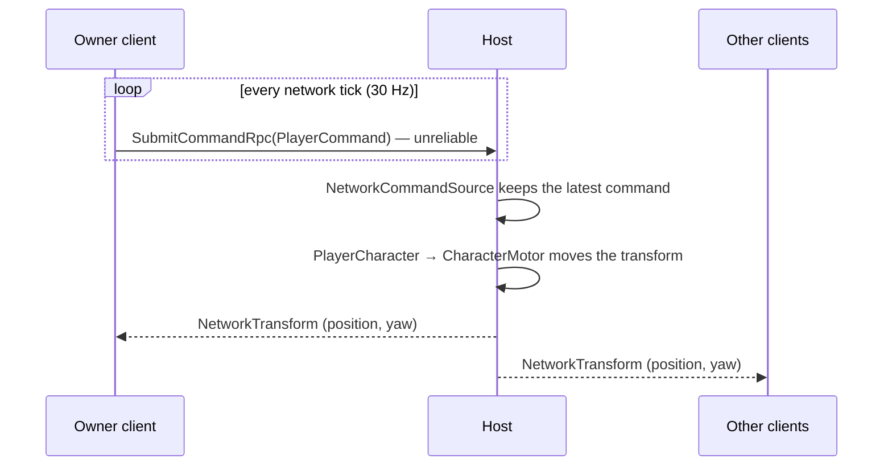
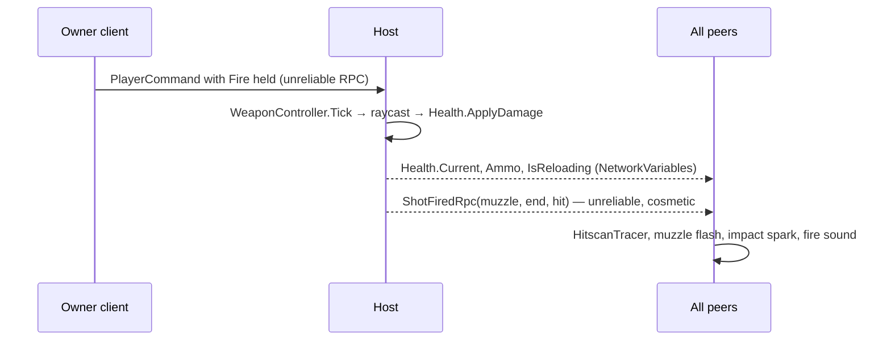

# Networking

How authority, ownership, and replication work in DropProtocol.

## Topology

Host/client via **Netcode for GameObjects** (NGO 2.x), 1–4 players. Dedicated servers are explicitly
out of scope for the vertical slice.

## Transport (Milestone 2)

Sessions connect **directly over Unity Transport** (UDP, port 7777). The host listens on all
interfaces; a client types the host's IP (optionally `ip:port`) into the menu. Locally, Multiplayer
Play Mode virtual players join `127.0.0.1`.

Relay and join codes through the Multiplayer Services SDK are the intended end state but
need the project linked to a Unity Gaming Services cloud project plus anonymous Authentication
sign-in. That is an out-of-band dashboard step, so it is deferred; `NetworkSession` is the only
place that configures the transport and is where Relay slots in later.

## Authority

The host/server is authoritative over:

- damage, health, death, reviving
- weapon fire resolution (the hitscan raycast runs on the server; decided in Milestone 3)
- enemy AI, enemy spawning
- mission state and objectives
- ability execution, pickups, combat results
- **character movement** (decided in Milestone 2, see below)

Clients own only:

- input collection
- their local camera
- UI and presentation
- sending gameplay *requests*

Clients never decide combat outcomes:

```text
Bad       Client: "I hit the enemy, remove 25 HP."

Preferred Client: "I fired weapon X in direction Y."
          Server: validate fire → resolve hit → apply damage → replicate result
```

### Movement authority

Movement is **server-authoritative with replicated commands**:

```text
Owner client                             Host / server
HumanCommandSource ─┐                    NetworkCommandSource (IPlayerCommandSource)
                    │ every network tick        ▲
NetworkPlayer ──────┴─ SubmitCommandRpc ────────┘ keeps the latest command
                                         PlayerCharacter → CharacterMotor (runs only here)
                                         NetworkTransform (server authority) → every client interpolates
```



- The owner samples `HumanCommandSource` on each network tick (30 Hz) and sends the `PlayerCommand`
  with an **unreliable** RPC. A lost sample is replaced by the next one.
- On the host, `NetworkCommandSource` hands the newest command to `PlayerCharacter`. It reports
  `PlayerCommand.None` when no command arrived for 0.5 s, so a frozen or disconnecting client stops
  walking instead of sliding forever.
- The host's own character reads `HumanCommandSource` directly, per frame, with no RPC hop.
- Non-server instances disable `PlayerCharacter` and the `CharacterController`; the motor must
  never fight `NetworkTransform` over the transform.

Why this and not the alternatives:

| Option | Verdict |
|---|---|
| Owner-authoritative `NetworkTransform` | Zero input latency and simplest, but movement would be the one gameplay system the host does not validate. Rejected for a project whose point is authoritative gameplay. |
| Server-authoritative + client prediction/reconciliation | Best feel, but a large system with no current need. Revisit only if latency proves unacceptable in play tests. |
| **Server-authoritative commands (chosen)** | One command path for humans, bots (Milestone 5), and tests. Cost: remote clients feel roughly one round trip of input latency. Acceptable for co-op PvE on LAN/regional connections. |

### Combat flow (Milestone 3)

Combat rides on the same command path; there is no separate "fire" RPC.

```text
Owner client                             Host / server
Fire / Reload / Interact held ─┐         PlayerCharacter forwards the command
                               │         WeaponController.Tick → Physics raycast → Health.ApplyDamage
SubmitCommandRpc (unreliable) ─┘         ReviveController.Tick → Health.Revive
                                         Health.Current (NetworkVariable) ──────────> every client
                                         WeaponController.ShotFiredRpc (ClientsAndHost, unreliable)
                                                                          └──> tracers only
```



- Damage, ammo, reload, and revive progress are **state**, so they replicate as `NetworkVariable`s
  and late joiners see current values. A per-hit RPC was rejected: it would need its own late-join
  story and could arrive out of order with the health it describes.
- The tracer is the one thing sent as an RPC, and it is unreliable: a lost tracer is a lost tracer,
  the damage already replicated.
- Clients see `NetworkTransform` interpolation roughly one tick behind the server, so a tracer may
  visually skim a moving target the server did hit. Accepted for co-op PvE; revisit only if it
  reads badly in play tests.
- Friendly fire is on. The raycast excludes only the shooter.

## Ownership and spawning

- `NetworkConfig.PlayerPrefab` is **not** used. Connection approval runs with
  `CreatePlayerObject = false`; a `PlayerSpawner` placed in the gameplay scene spawns
  `PlayerCharacter` for every connected client once the scene is up, and for late joiners on
  `OnClientConnectedCallback`. This guarantees ground under a player and keeps the menu scene free of
  characters.
- Connection approval enforces `SessionRules.MaxPlayers` (4) and returns `"Session is full"` as the
  disconnect reason otherwise.
- Squad slot = spawn point index = `NetworkPlayer.PlayerIndex` (server-written `NetworkVariable`).
  Slots are reused when a client leaves. `PlayerTint` colours a marker from it; presentation only.
- Player objects are `DestroyWithScene`; NGO despawns them when their owner disconnects.

## Scene flow

```text
00_Bootstrap (NetworkRoot: NetworkManager + UnityTransport + NetworkSession, DontDestroyOnLoad)
    ↓ Bootstrap.Start
01_MainMenu ────── Host ──> NetworkSceneManager.LoadScene("10_Mission_Test")
                ── Join ──> connect; NGO synchronises the client to the host's scene
10_Mission_Test ── Leave / disconnect / Return to menu ──> SceneManager.LoadScene("01_MainMenu")
90_Sandbox ─────── Leave / disconnect ──> SceneManager.LoadScene("01_MainMenu")
```

`NetworkManager` cannot be nested and NGO does not destroy a second one, so `NetworkRoot` lives at
the root of `00_Bootstrap` only. The HUD's `SessionPanel` instantiates it when a gameplay scene is
played directly, and `NetworkSession.StartHost()` loads the gameplay scene only when the
menu is the active scene: hosting from any other scene keeps that scene.

The mission scene assembles its map in `MissionMap.Awake`, which runs on scene activation, before
NGO spawns the in-scene NetworkObjects, so the host has anchors and a NavMesh when `PlayerSpawner`
and `EnemyDirector` spawn. A remote client skips that step and assembles when the `MissionMap`
object spawns with the host's seed. `NetworkSession.ReloadGameplayScene()` (host only, the F1
"New map" button) loads the same scene again through the `NetworkSceneManager`: every peer
reloads, the in-scene objects respawn, `PlayerSpawner` respawns the whole squad and the session
stays up.

## Disconnect handling

`NetworkSession` is the single owner of session lifetime:

- Host `Leave()` shuts the server down; every client receives a disconnect and returns to the menu.
- Client `Leave()`, host shutdown, transport failure, or approval rejection all end in
  `OnClientStopped`; the session records a reason (`NetworkManager.DisconnectReason`, or
  "Connection lost" / "Could not connect to host" when NGO gives none) and loads `01_MainMenu`,
  where the menu shows it.
- A host shutdown raises both the server- and client-stopped callbacks; the session handles the
  first and ignores the second.

## Bots (Milestone 5)

Bots are **not** fake network clients. They run on the authoritative host and drive ordinary player
characters through `IPlayerCommandSource`, exactly like a remote human's replicated input.

```text
Remote Human ──> Network Input ──┐
Bot Brain ───────────────────────┼──> PlayerCommand ──> PlayerCharacter ──> Authoritative Game
                                 │                                              │
                                 └──────────────────────────────────────────────▼
                                                                        Replicated State
```

- A bot is a plain server-owned `NetworkObject.Spawn` of the player prefab, never a player object:
  `SpawnAsPlayerObject` would replace the host's own character.
- On the host a server-owned object is `IsOwner`, so `NetworkPlayer` would bind the prefab's
  `HumanCommandSource` and become `LocalPlayer`. `PlayerSpawner` calls `ConfigureBot` before
  `Spawn()`; a bot then takes its own source and skips the local-player path, so the camera stays
  with the human.
- `IsBot` is server-side truth only. Nothing about a bot is replicated; clients see an ordinary
  squadmate with a slot tint. A replicated flag arrives with name tags if they ever need one.
- Connection approval counts humans only, so bots never block a join. A joining human evicts the
  highest bot slot; a leaving human's slot is refilled while `FillWithBots` is on.

## Replicated state

- Transform: `NetworkTransform`, server authority, position XYZ + yaw only, half-float precision,
  interpolated on clients.
- `NetworkPlayer.PlayerIndex`.
- `Health.Current` (int; downed is derived from zero), `WeaponController.Ammo` and
  `IsReloading`, `ReviveController.Progress`. All server-written.
- Enemies: the same `NetworkTransform` settings plus `Health.Current`; the NavMeshAgent and the
  brain run on the host only. `SpitProjectile`: position-only `NetworkTransform`, spawned and
  despawned by the server.
- Mission (Milestone 6): `MissionDirector.Phase`, `Outcome`, `RelayCount`, `RelaysActivated`,
  `DeployRemaining`, `Elapsed`, `TimeLimit`, `ExtractionRemaining`, `ExtractedCount`,
  `EnemiesKilled`, and `CommRelay.Progress` / `IsActivated`. All server-written on in-scene
  NetworkObjects, so a late joiner receives the current mission state with the scene.
- Support protocols (Milestone 7): `ProtocolController.Entered` (the accepted prefix packed into
  one int) and `Cooldowns` (a three-float memcpy struct) on every player; `SupplyPod.IsOpen` /
  `Served`; `SentryTurret.Ammo` / `IsDeployed` plus its yaw through a `NetworkTransform` that syncs
  position and Y rotation; `StrikeBeacon.Remaining` / `HasStruck`. Direction presses travel
  client→host on a reliable, owner-only RPC (`SubmitDirectionRpc`), never inside `PlayerCommand`;
  sentry tracers use the same unreliable cosmetic RPC as the rifle. The three payload prefabs are
  registered because the host spawns them at runtime.
- Presentation (Milestone 8): no `NetworkAnimator` and no bone transforms. Locomotion is derived
  on every peer from the transform `NetworkTransform` already moves. Three small additions make
  host-only state visible: `NetworkPlayer.IsInteracting` (bool, the applied Interact),
  `EnemyCharacter.ReplicatedState` (the brain state; `State` reads it on every peer) and
  `ProtocolController.Called`, an unreliable cosmetic RPC like `ShotFired` sent after a payload
  spawns. VFX and SFX hang off these and off `Health.Current` changes, so damage feedback needs no
  attacker information.
- Map: `MissionMap.Seed` (int, server-written at spawn). Every peer assembles the same tile grid
  from it locally; tiles, anchors and the NavMesh never replicate. The three in-scene relays and the
  extraction zone are moved onto the layout's anchors on every peer by the same rules, and NGO also
  carries the server's pose of the in-scene relays in their spawn message.
- HUD (Milestone 8): `NetworkPlayer.BotFlag` (bool, server-written at spawn) labels squad rows;
  everything else the HUD shows was already replicated. The F3 overlay reads the Multiplayer Tools
  net stats monitor and `UnityTransport.GetCurrentRtt`.

## Testing

- EditMode: `PlayerCommand` serialization round-trip, `SessionRules`, `NetworkCommandSource`
  staleness, `SpawnSlots`.
- EditMode (Milestone 3): `WeaponState` fire rate and reload, `WeaponMath` spread, `HealthRules`,
  `ReviveRules`.
- EditMode (Milestone 4): `EnemyRules`, `EnemyBrain` windup and cooldown, `ProjectileMath`,
  `DirectorRules`, `DirectorState` budget and determinism.
- EditMode (Milestone 5): `BotRules` hysteresis, reload policy and corner skipping, `BotBrain`
  priority ladder and reload edge, `SpawnSlots.SlotToEvict`.
- EditMode (Milestone 6): `MissionRules` (wipe, time limit, relay step, extraction pause,
  intensity), `MissionState` transitions and precedence, `BotBrain` objective rung.
- EditMode (Milestone 7): `ProtocolRules` (rising edges, match pending/matched/rejected,
  prefix-free loadout, pack/unpack, placement, call gate), `ProtocolState` (timeout, cooldowns,
  buffer cap), `HealthRules.AfterHeal`, `WeaponState.Refill`.
- PlayMode: `NetworkPlayerHostTests` starts an in-process host, spawns a code-built player owned by
  a fake remote client, and drives it through `NetworkPlayer.SubmitCommand`. `CombatHostTests`
  reuses that harness to check that firing damages a dummy and a teammate, magazines empty and
  refill, downed characters ignore commands, and a held `Interact` revives.
  `EnemyHostTests` and `EnemyDirectorHostTests` share `HostTestHarness`, which bakes a runtime
  NavMesh on the test plane: grunts chase and hit the nearest alive player, dead enemies despawn,
  spit projectiles land, are blocked by 1 m cover and ignore enemies, and the director respects
  budget, population cap and spawn distance. `SandboxSmokeTests` loads the real `90_Sandbox`, hosts through
  `NetworkSession`, and checks that the in-scene director spawns the real prefabs, which cross the
  baked NavMesh and hurt the host player.
  `BotHostTests` spawns bots through `HostTestHarness.SpawnBot`: they follow the nearest human,
  path around a wall, fire at an enemy, hold fire behind a squadmate, back off from a close enemy,
  revive a downed human, reload once nothing is in sight, and `PlayerSpawner` fills, removes and
  refills bot slots. `SandboxSmokeTests` also fills the real sandbox with bots and checks that they
  kill a grunt while the host stays the local player. Eviction on a human join needs a second
  process and is covered by Multiplayer Play Mode.
  `MissionHostTests` builds relays, a zone and a `MissionDirector` in code: relays charge from a
  held `Interact` inside the radius only, keep progress on release, ignore downed players and a
  revive in progress, and stay quiet during deployment; the mission reaches Active, Extraction and
  Complete, pauses extraction while nobody stands inside, fails on a wipe or the clock, counts
  kills, and drives the director. Bots activate a relay near their leader, ignore one far from it,
  and walk into the zone. `MissionSmokeTests` loads the real `10_Mission_Test`, hosts from it,
  and checks the bots fill the squad, the mission leaves deployment, and the local player's
  loadout has three protocols with payload prefabs.
  `ProtocolHostTests` builds a player with a code-configured loadout and code-built payload
  templates and pushes directions into `ProtocolController.SubmitDirection`: a matched sequence
  spawns the payload ahead of the caller, a wrong key or the timeout clears the prefix, cooldown,
  downed state and deployment block a call; the supply pod heals and refills a standing player
  once and skips a downed one, the sentry kills a grunt in range and ignores one out of range, and
  the strike hurts nothing before the warning and everything inside the radius after it.
- Multi-process: Multiplayer Play Mode runs host + clients inside one Editor; Multiplayer Tools
  provides the network profiler and the runtime debug overlay planned for Milestone 8.

## Log

- **2026-09-11 — Transport: direct Unity Transport first.** Relay/join codes deferred until the
  project is linked to UGS; no dashboard dependency for Milestone 2.
- **2026-09-11 — Movement: server-authoritative commands.** Rejected owner-authoritative
  transforms (unvalidated movement) and prediction (premature complexity). Revisit prediction only
  on evidence from play tests.
- **2026-09-11 — Spawning: scene-owned `PlayerSpawner`, not `NetworkConfig.PlayerPrefab`.** Avoids
  spawning into the menu scene and keeps slot assignment in one place.
- **2026-09-11 — Session UI: minimal uGUI menu.** Sandbox keeps its own Host/Join panel so it never
  depends on the menu flow.
- **2026-09-11 — Combat: hitscan resolved on the server.** Rejected client-reported hits
  (unvalidated) and projectiles (no requirement for travel time yet; the hit mode stays in the data).
- **2026-09-11 — Damage as replicated state, tracers as an unreliable RPC.** Rejected an RPC per hit;
  `NetworkVariable`s give late joiners the truth for free.
- **2026-09-11 — Death: downed plus teammate revive, no respawn.** Bleed-out and squad wipe are
  mission rules (Milestone 6).
- **2026-09-11 — Target dummies are in-scene placed NetworkObjects.** No spawner and no prefab
  registration until something spawns them at runtime.
- **2026-09-11 — Enemies: NavMeshAgent on the host, NetworkTransform for clients.** Rejected
  client-side agents (they would need reconciliation) and a CharacterController on enemies (the
  agent already moves them). Enemy and projectile prefabs are registered because the director
  spawns them at runtime.
- **2026-09-11 — Spit: server-simulated projectile NetworkObject.** Rejected hitscan with a
  windup (not dodgeable) and a Rigidbody projectile (a collider would block player hitscan and the
  revive probe). One sphere sweep per server step is deterministic and cheap.
- **2026-09-11 — Player and enemy registries are static lists.** Rejected physics overlap
  discovery (radius and per-frame cost) and a manager class; three consumers justify the static.
  Entries are also removed on destroy because a host shutdown skips the despawn callback.
- **2026-09-11 — Director: deterministic threat budget.** Roll and time are injected; the scene
  object seeds a `System.Random`. Rejected a spawn timer per archetype.
- **2026-09-11 — Bots: host-side command sources, not fake clients.** Rejected fake clients
  (approval, ownership and RPC hops for nothing) and a NavMeshAgent on the player prefab (bots must
  drive the character humans drive); paths come from `NavMesh.CalculatePath` at think rate.
- **2026-09-11 — Bot slots belong to `PlayerSpawner`.** Rejected reserving slots in approval;
  humans always win by evicting the last bot, and `IsBot` stays server-side until a client needs it.
- **2026-09-11 — Mission: pure phase machine fed by counts, replicated as `NetworkVariable`s.**
  Rejected an RPC-based results message (late joiners) and mission logic inside `NetworkSession`
  (the session outlives scenes; the mission is scene state).
- **2026-09-11 — Relay interaction reads applied commands on the server.** Rejected
  `InteractionController` / `IInteractable`: revive and relay keep progress in different places on
  purpose, and one interface over both would hide that.
- **2026-09-11 — Extraction pauses, never resets; downed squadmates are left behind.** Rejected
  requiring every standing player inside (a straggler stalls everyone).
- **2026-09-11 — Protocol directions: one reliable owner RPC per press, matched on the host.**
  Rejected riding `PlayerCommand` (unreliable, latest-only: a press can vanish) and client-side
  matching with a single request (the host is the one validating the sequence). The accepted
  prefix and cooldowns replicate back as `NetworkVariable`s for the HUD.
- **2026-09-11 — Payloads carry no collider and no health; area damage walks the registries.**
  Rejected physics overlap for the strike (consistent with the registry decision) and a targetable
  sentry (it would enter enemy targeting and wipe rules). The sentry is the second hitscan user, so
  `Hitscan` and `IShotSource` were extracted then, not before.
- **2026-09-11 — Hosting from a non-menu scene keeps that scene.** The gameplay scene is only
  loaded from the menu, so the sandbox and the mission scene both self-host.
- **2026-09-11 — Animation is derived, not replicated.** Rejected `NetworkAnimator` (bone and
  parameter traffic for state the peers can already compute) in favour of transform-delta
  locomotion plus the existing NetworkVariables. The enemy brain state became a mirrored
  `NetworkVariable` because clients had no way to see an attack windup.
- **2026-09-11 — The HUD binds to NetworkVariables, nothing is replicated for it.** The one
  addition is a bot flag; revive target and attacker position stay server-only (a squad-wide
  progress maximum and an undirected damage flash are good enough).
- **2026-09-11 — Presentation re-reads replicated state in `OnNetworkSpawn`.** The initial field
  sync in Netcode never raises `OnValueChanged`, so `OnEnable`-time reads left a joiner with zero
  health, downed poses and unassigned tints. Rejected per-frame polling (hides the event model) and
  re-firing `OnValueChanged` from the owners (fakes a change).
